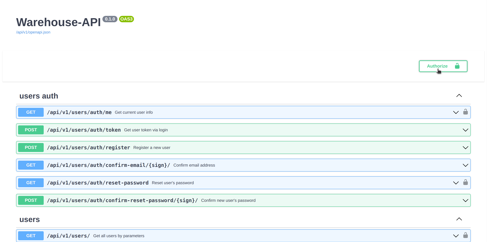
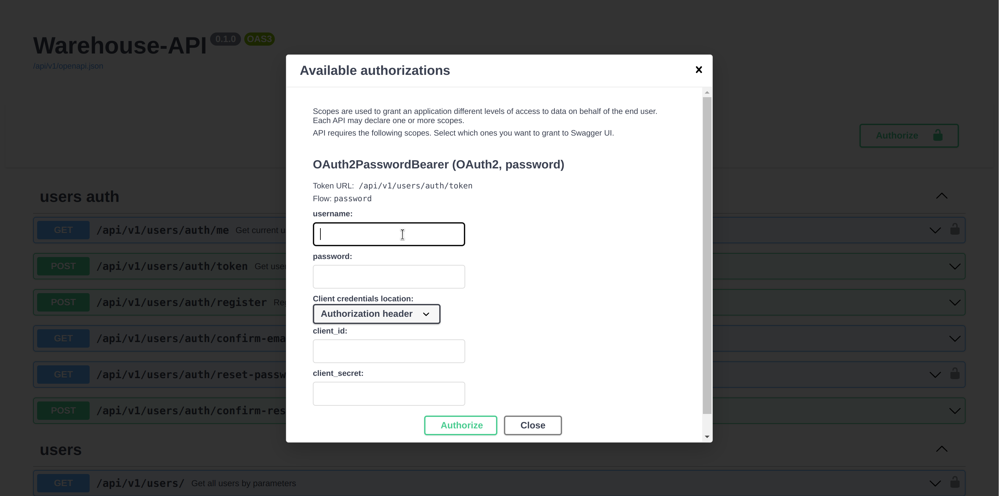
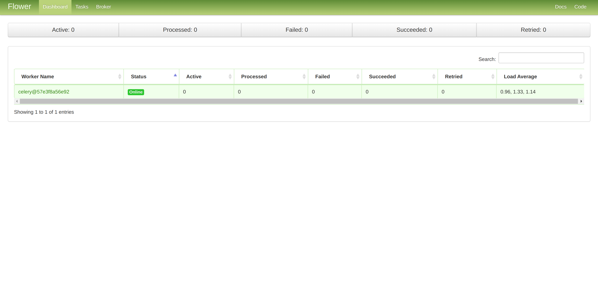

# REST-API WAREHOUSE
# !!!ATTENTION!!! Development in progress. Everything can change.
This application is designed to manage the data of warehouse.
---
## Project stack:


- `FastAPI`
- `Pydantic`
- `async-SqlAlchemy`
- `Alembic`
- `Swagger`
- `Pytest`
- `PostgreSQL`
- `Redis`
- `Docker (docker-compose)`
- `Nginx`
- `Celery + Flower`
---
## Installation:
First you need to create `.env` file with environment variables at the root of the project, that contains:
```
PG_SUPER_DB=superuser_database_name (by default: postgres)
PG_SUPER_USER=superuser_login (by default: postgres)
PG_SUPER_PASSWORD=superuser_password (by default: postgres)
PG_HOST=host_url (by default: localhost)
PG_PORT=postgres_port  (by default: 5432)
PG_USER_DB=your_database_name (by default: warehouse)
PG_USER=your_user_name (example: admin)
PG_USER_PASSWORD=your_user_password

PGADMIN_DEFAULT_EMAIL=your_email
PGADMIN_DEFAULT_PASSWORD=your_password

INSERT_PREPARED_DATA=FALSE (`TRUE` if you want to populate the db with test or prepared data)

MAIL_USERNAME=your_email
MAIL_PASSWORD=youe_email_password
MAIL_FROM=your_email
MAIL_PORT=your_port
MAIL_SERVER=your_mail_server
MAIL_FROM_NAME=your_email

REDIS_HOST=redis (`redis` if you using docker-compose)
REDIS_PORT=6379
REDIS_PASSWORD=your_redis_password

FLOWER_USER=your_username
FLOWER_PASSWORD=your_user_password
```

### Installation via Docker-compose:

<details>
<summary>STEP 1 - Install DOCKER and DOCKER COMPOSE:</summary>

**For the beginning install `docker` and `docker compose` on your machine:**
1) **[docker](https://docs.docker.com/engine/install/ubuntu/)**
2) **[docker-compose](https://docs.docker.com/compose/install/)**
3) **P.S.: Depending on the version use:**
    ```commandline
    docker compose
    ```
   Or
    ```commandline
    docker-compose
    ```
</details>

<details>
<summary>STEP 2 - GIT clone:</summary>

1) **Then `git clone` this project in your folder.**
2) **And go to the `manage` directory where are `.sh` scripts are located.**
</details>

<details>
<summary>STEP 3 - BUILD and UP project:</summary>

**Use following command:**
- production container:
   ```commandline
   bash start.sh
   ```
- or if you want to build development container:
   ```commandline
   bash start.sh --dev
   ```
</details>

<details>
<summary>STEP 4 - Try to get DATA:</summary>

```commandline
curl http://0.0.0.0:8080/api/v1/products/
```
After the request, you should get something like that: `{"detail":"Not authenticated"}`.
That means it's all right.

</details>

<details>
<summary>STEP 5 - Get api docs in your browser:</summary>

- **[http://0.0.0.0:8080/api/v1/docs](http://0.0.0.0:8080/api/v1/docs)**

OR

- **[http://0.0.0.0:8080/api/v1/redoc](http://0.0.0.0:8080/api/v1/redoc)**

After you got swagger docs, you can log in.



If you set `INSERT_PREPARED_DATA` to `TRUE`, just enter following data:
1) see work as admin:
    ```
    username: admin
    password: 123456789
    ```
2) see work as an authorized and confirmed client
    ```
    username: client1
    password: 123654789
    ```
3) see work as an authorized and unconfirmed client
    ```
    username: client2
    password: 123654789
    ```


You can also see the flower dashboard. 
For this just follow the link **[http://0.0.0.0:8080/flower/](http://0.0.0.0:8080/flower/)**.
If you set `FLOWER_USER` and `FLOWER_PASSWORD` before, you will need them now.



</details>

<details>
<summary>STEP 6 - Run pytest:</summary>

**If you use development mode, you can run pytest:**
- First, enter to the container:
    ```commandline
    docker exec -it warehouse-backend-dev bash
    ```
- Second, run `pytest` command:
    ```bash
    cd tests/ && python -m pytest
    ```
</details>

<details>
<summary>STEP 7 - RESTART containers:</summary>

- to restart the containers:
   ```commandline
   bash restart.sh
   ```
- if you have previously run a development container:
   ```commandline
   bash restart.sh --dev
   ```
</details>

<details>
<summary>STEP 8 - STOP and REMOVE containers:</summary>

- to stop and remove the containers:
   ```commandline
   bash stop.sh
   ```
- if you have previously run a development container:
   ```commandline
   bash stop.sh --dev
   ```
</details>

<details>
<summary>STEP 9 - REMOVE all containers DATA:</summary>

- to remove all containers data:
   ```commandline
   bash remove.sh
   ```
- if you have previously run a development container:
   ```commandline
   bash remove.sh --dev
   ```
</details>

<details>
<summary>POSSIBLE ERRORS:</summary>

- **if you get `postgres` warnings after app started,
then you should probably change outer port for `postgres` in `docker-compose.yml`:**
    ```yaml
    ports:
      - '5432:5432'
    ```
   *change to ↓*
    ```yaml
    ports:
      - '5632:5432'
    ```
- **if you got something like this:**
   ```commandline
   Got permission denied while trying to connect to the Docker daemon socket at unix:///var/run/docker.sock:...
   ```
   *Use:*
   ```commandline
   sudo chmod 666 /var/run/docker.sock
   ```
- **if you use ubuntu, then you will probably have a problems with psycopg2.
So install this:**
    ```commandline
    sudo apt-get install libpq-dev
    ```
</details>

### Installation via IDE:

<details>
<summary>STEP 1 - Create env and install packages:</summary>

1) First, install **[poetry](https://python-poetry.org/docs/#installation)**:
    ```commandline
    pip install poetry
    ```
2) ```commandline
   poetry shell
   ```
3) ```commandline
   poetry install
   ```
    Or
   ```commandline
    poetry install --no-dev
   ```
</details>

<details>
<summary>STEP 2 - Start api:</summary>

**Go to the root project directory.**

`Ubuntu` (`Bash`):
```bash
python -m src.db --create_db
```
```bash
cd src/db && alembic upgrade head
```
```bash
uvicorn src.api.app:app --reload
```
</details>

<details>
<summary>STEP 3 - Get api docs:</summary>

**Get docs and data in your browser:**
```
http://localhost/api/v1
```
Or
```
http://127.0.0.1:5000/api/v1
```
Or
```
http://0.0.0.0:5000/api/v1
```
</details>

---
## Migrations:

<details>
<summary>If you begin only and have no database and have no migrations folder:</summary>

`Ubuntu` (`Bash`):
```bash
python -m src.db --create_db
```
```bash
cd src/db && alembic init -t async alembic_migrations
```
```bash
alembic revision --autogenerate -m "first_migration"
```
```bash
alembic upgrade head
```
</details>

<details>
<summary>If you want update models only:</summary>

`Ubuntu` (`Bash`):

```bash
alembic revision --autogenerate -m "update_model"
```
```bash
alembic upgrade head
```
</details>

---
## CLI
<details>
<summary>CREATING DATABASE</summary>

**Simple command line interface, that:**

1) allows you to create db:
   ``` commandline
   python -m src.db --create_db
   ```
2) allows you to drop db:
   ``` commandline
   python -m src.db --drop_db
   ```
3) And contains optional arguments:
    - `-d`, `--db_name`, allows assign db name:
   
        ``` commandline
        python -m src.db --drop_db -d your_db_name
        ```

    - `-u`, `--user_name`, allows assign username:
   
        ``` commandline
        python -m src.db --create_db -u your_user_name
        ```
    
    - `-r`, `--role_name`, allows assign role name:
   
        ``` commandline
        python -m src.db --create_db -r your_role_name
        ```
    
    - `-p`, `--user_password`, allows assign user password:
   
        ``` commandline
        python -m src.db --create_db -p your_user_password
        ```
4) Helper:
    ``` commandline
    python -m src.db -h
    ```

**IMPORTANT:** **If the arguments is not specified, it is taken from the env variables or set by default.**
</details>

<details>
<summary>POPULATING DATABASE</summary>

1) Populate the empty database with prepared data.:
   ``` commandline
   python -m src.utils.db_populating --populate_db
   ```
2) Helper:
    ``` commandline
    python -m src.utils.db_populating -h
    ```
</details>